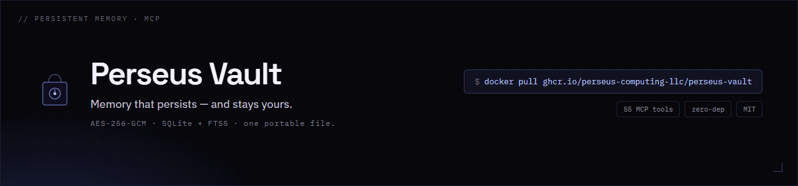

<div align="center">
  
</div>

# Perseus Vault

<!-- mcp-name: io.github.Perseus-Computing-LLC/perseus-vault -->

> **Persistent, encrypted memory for AI agents. One Rust binary, one file, no cloud.**

[](https://github.com/Perseus-Computing-LLC/perseus-vault/actions/workflows/test.yml)
[](./LICENSE)
[](https://github.com/Perseus-Computing-LLC/perseus-vault/releases)
[](https://glama.ai/mcp/servers/Perseus-Computing-LLC/perseus-vault)
[](integrations/langgraph/)
[](integrations/crewai/)
[](integrations/autogen/)

**Published on** [Official MCP Registry](https://registry.modelcontextprotocol.io/v0/servers?search=io.github.Perseus-Computing-LLC/perseus-vault) · [Glama](https://glama.ai/mcp/servers/Perseus-Computing-LLC/perseus-vault) · [mcpservers.org](https://mcpservers.org/servers/perseus-computing-llc/perseus-vault) · [Docker (GHCR)](https://github.com/Perseus-Computing-LLC/perseus-vault/pkgs/container/perseus-vault)

Give your agents memory that survives the session, so they stop re-deriving what they
already learned and stop repeating past mistakes. Hybrid recall (BM25 + dense + RRF),
bi-temporal history, and **AES-256-GCM** at rest are exposed through a canonical MCP
surface that works with any host. The exact v2.23.2 `--no-default-features` snapshot
published in the [versioned API reference](https://perseus.observer/vault/mcp-reference/)
contains **175 unique canonical tools**; counts are release/profile-specific and are
also recorded in the published [`metadata.json`](https://perseus.observer/vault/mcp-reference/metadata.json).

The source-checked LongMemEval claim is the fully offline **session-level recall**
measurement in [`benchmark/longmemeval/`](benchmark/longmemeval/README.md): on the public
`_s` split (500 questions, 23,867 sessions), the committed hybrid path reaches
**83.2% recall@1, 98.8% recall@5, 99.8% recall@10, and 0.8949 MRR** against
`answer_session_ids`. It is judge-free and uses the real binary with bundled local
embeddings; it is a retrieval metric, **not end-to-end QA accuracy**. The exact
report, harness, and reproduction command are documented in that directory.

[Perseus Context Engine](https://github.com/Perseus-Computing-LLC/perseus) resolves the present; [Perseus Ledger](https://github.com/Perseus-Computing-LLC/ledger) records the evidence. Vault is the durable-memory layer between them.

**One binary. One file. No Docker. No Postgres. No cloud.** Local-first, air-gap ready, MIT.

## One-Line Install

```bash
curl -sSf https://raw.githubusercontent.com/Perseus-Computing-LLC/perseus-vault/main/scripts/install.sh | sh
```

That's it. Perseus Vault is installed to `~/.local/bin/perseus-vault`. Start it:

```bash
perseus-vault serve --db ~/.perseus-vault/data/perseus-vault.db
```

> **Encryption is enabled automatically for the default installation.** The first
> run creates `~/.perseus-vault/secret.key` with owner-only permissions and an
> encrypted database canary. Back up that key: it cannot be recovered. Explicit
> `--encryption-key` paths remain supported, and existing plaintext databases are
> preserved for migration with `perseus-vault init --rekey`. Use `doctor` to
> inspect the actual on-disk state.

> **macOS note (Apple Silicon).** A freshly built or copied binary is
> SIGKILLed on first run (`Killed: 9`, no other output) by the OS binary
> policy — even with no quarantine attribute. The one-line installer and the
> `bootstrap.sh` build-from-source installer ad-hoc code-sign Perseus Vault for
> you. If you build the binary yourself, sign it once **after each rebuild**:
>
> ```bash
> cargo build --release
> cp target/release/perseus-vault ~/.local/bin/perseus-vault
> codesign --force --sign - ~/.local/bin/perseus-vault   # required on Apple Silicon; fixes "Killed: 9"
> ```
>
> `--force` re-signs an already-signed binary (needed after every rebuild); the
> step is harmless on Intel macOS and unnecessary on Linux/Windows.

Then wire your MCP client(s) — and the full recall/capture loop — in one command:

```bash
perseus-vault install-client --hooks --rules
```

This autodetects Claude Code / Codex / Cursor (pass `--client <name>` for
claude-desktop, hermes, windsurf, vscode, zed, or generic; `--all-detected`
wires every detected client), merges the MCP server registration into the
client's config without clobbering anything (a `.bak-perseus` backup is
written first), points every client at **one shared memory database**,
registers the session lifecycle hooks (recall injection on SessionStart,
hygiene on session end — the `docs/lifecycle-hooks.md` contract), and appends
the memory usage rules to `CLAUDE.md`/`AGENTS.md`. Re-running is a no-op; add
`--dry-run` to preview every file it would touch.

Or connect any MCP host by hand (Claude Desktop, Cursor, Hermes Agent, Perseus, etc.):

```json
{
  "mcpServers": {
    "perseus-vault": {
      "command": "perseus-vault",
      "args": ["serve", "--db", "~/.perseus-vault/data/perseus-vault.db"]
    }
  }
}
```

## For Agents: Connect Over MCP

When the primary consumer is an agent, the interface is **MCP** — the agent
adopts the Vault through its MCP client, and no per-machine CLI install is
needed beyond running the server itself:

```bash
# 1. Run the server (one line)
perseus-vault serve --db ~/.perseus-vault/data/perseus-vault.db &

# 2. Register it in the agent's MCP client config
#    { "mcpServers": { "perseus-vault": {
#        "command": "perseus-vault",
#        "args": ["serve", "--db", "~/.perseus-vault/data/perseus-vault.db"] } } }

# 3. Verify the agent-facing surface
perseus-vault doctor
```

`perseus-vault install-client --hooks --rules` wires the whole
recall/capture loop for Claude Code / Codex / Cursor / Hermes in one command.
For the agent-facing capability map — which tool does which job, and the
planning-boundary pattern — see
[docs/integration/agent-adoption.md](docs/integration/agent-adoption.md).
For the cross-tier architecture and evaluator boundary, see the
[Evaluator Guide](docs/EVALUATOR_GUIDE.md).

## 30-Second Quickstart

```bash
# Start Perseus Vault
perseus-vault serve --db memory.db &
sleep 1

# Remember a fact (via MCP JSON-RPC on stdio)
echo '{"jsonrpc":"2.0","id":1,"method":"tools/call","params":{"name":"perseus_vault_remember","arguments":{"category":"demo","key":"hello","body_json":"{\"text\":\"Hello from Perseus Vault!\"}"}}}' | perseus-vault serve --db memory.db

# Search for it
echo '{"jsonrpc":"2.0","id":2,"method":"tools/call","params":{"name":"perseus_vault_recall","arguments":{"query":"Hello"}}}' | perseus-vault serve --db memory.db
```

## Memory model and operational boundaries

Perseus Vault keeps three planes distinct:

- **Implicit working context** is the host's current prompt, transcript, and any
  context block a client chooses to inject. It is ephemeral and host-owned; it
  is not persisted merely because Vault returned it.
- **Explicit durable memory** is written by an explicit
  `perseus_vault_remember`, `perseus_vault_capture`, `write`, or `capture`
  operation. The Vault server owns the SQLite record, history, journal, decay,
  archive, and purge lifecycle.
- **Derived projections** include consolidated or synthesized records and
  exported Markdown. They carry provenance, but they are not a replacement for
  the durable source records and may need separate cleanup.

`perseus-vault prepare` and `perseus_vault_context` read durable records to
produce a bounded, task-relevant **active working context**. This is a rolling
snapshot, not a background write or a promise that the client will retain it:
refresh it when the task changes, and do not treat prompt text as durable memory
unless an explicit capture/write operation succeeds. Recall-first output is
budgeted (1500 characters by default, 6000 for large-window hosts, or an
explicit `max_context_chars`); the `always_on` set is capped at five. See
[retention and context semantics](docs/retention.md).

Lifecycle hooks and client installers are optional orchestration. They request
server-owned recall, capture, maintenance, and refresh work; they do not become
a second store or change retention policy. If the server or a hook is
unavailable, continue the task without injected memory and surface the degraded
state. A host integration may have an explicitly configured local fallback, but
that fallback must be labeled local-only and must not be presented as durable
Vault recall; a failed explicit write must never be reported as persisted. For
upgrade/recovery steps, use the
[upgrade and migration playbook](docs/migration/upgrade-playbook.md).

## Works With Every MCP Client

Perseus Vault is a standard MCP **stdio** server — the same `perseus-vault serve` command works
everywhere. Run `perseus-vault doctor` to validate your install and print this matrix locally.

| Client | Status | Config | 
|---|---|---|
| Claude Desktop | ✅ | `claude_desktop_config.json` |
| Claude Code / Hermes | ✅ | `.mcp.json` / `config.yaml` |
| Cursor | ✅ | `.cursor/mcp.json` |
| Windsurf | ✅ | `mcp_config.json` |
| VS Code + Continue.dev | ✅ | `config.json` |
| Zed | ✅ | `settings.json` |
| Codex CLI | ✅ | `~/.codex/config.toml` |

Copy-paste config snippets for each: **[docs/clients/](docs/clients/)**.

Then wire the **recall → work → capture → consolidate** loop to your client's
session events (SessionStart/Stop hooks for Claude Code, Codex, and Cursor,
plus a portable AGENTS.md fallback): **[docs/lifecycle-hooks.md](docs/lifecycle-hooks.md)**.

Composing with a memory washer (CoalWash) and a runtime output compactor
(Noisegate) for end-to-end context-budget control:
**[docs/integration/context-budget-stack.md](docs/integration/context-budget-stack.md)**.

Auditing what the Vault remembers, from where, and under which authority:
**[docs/evidence-chain-guidance.md](docs/evidence-chain-guidance.md)** — evidence chains,
write-time provenance tags, and continuous attestation for durable memory.

## Memory banks (per-client isolation, one profile)

Agency running 50 clients with the same playbook? Don't duplicate profiles —
designate the **memory bank** per project and keep one Hermes profile, one
Vault, and one shared skill library:

```markdown
# .hermes.md
memory_bank: acme-seo            # name → deterministic workspace hash
memory_bank_workspace: <64-hex>  # optional explicit workspace override
```

The [Hermes memory provider](https://github.com/Perseus-Computing-LLC/hermes-plugin-perseus-vault)
(`hermes plugins install Perseus-Computing-LLC/hermes-plugin-perseus-vault`)
resolves the bank once per session and scopes every Vault read and write —
prefetch recall, `perseus_recall` / `perseus_remember` / `perseus_forget`,
session-end capture — to a dedicated workspace. Bank names map
deterministically (`sha256("memory-bank:" + name)`), so every instance
pointing at the same name addresses the same workspace with no registry to
maintain. Workspaces are first-class on the server: scoped maintenance, dedup
isolation between banks, and per-workspace authority manifests. Discovery
mirrors Hermes project-context rules (nearest `.hermes.md` wins, bounded at
the git root); a context file without a directive means no bank — the
configured workspace stays in effect.

## Why Perseus Vault

Perseus Vault is designed to be MCP-native, local-first, zero-dependency, and
agent-first.

### LongMemEval retrieval (offline, judge-free)

The current public measurement is the reproducible retrieval lane in
[`benchmark/longmemeval/`](benchmark/longmemeval/README.md), not the deprecated
LLM-answer-and-judge experiment. It drives the real binary over MCP stdio and
checks whether a gold evidence session appears in the requested rank window,
using LongMemEval's `answer_session_ids` on the public `_s` split.

The committed report covers 500 questions and 23,867 ingested sessions:

| path | recall@1 | recall@3 | recall@5 | recall@10 | MRR |
|---|---:|---:|---:|---:|---:|
| keyword only (`fts5`) | 4.2% | 12.2% | 19.2% | 33.6% | 0.1069 |
| dense | 75.8% | 88.0% | 91.8% | 96.0% | 0.8296 |
| **hybrid (RRF)** | **83.2%** | **96.6%** | **98.8%** | **99.8%** | **0.8949** |

These are session-level retrieval metrics: offline, judge-free, and not
end-to-end QA accuracy. Reproduce the exact source-checked report with the
commands in the benchmark README; the committed artifact is
[`report-currentmain-2026-08-16.json`](benchmark/longmemeval/report-currentmain-2026-08-16.json).
The deprecated [`benchmarks/LONG_MEM_EVAL.md`](benchmarks/LONG_MEM_EVAL.md)
explains why the earlier model/judge numbers are not used as public claims.

### LOCOMO (mem0's own harness)

Measured on mem0's own LOCOMO harness ([our fork](https://github.com/Perseus-Computing-LLC/memory-benchmarks)), not ours — cats 1–4, 1,540q, top-200, gpt-5 answerer + judge:

| Engine | Overall | Single | Temporal | Multi | Open-domain |
|---|---|---|---|---|---|
| **Perseus Vault 2.20.2** | **87.9%** | 89.1 | 92.2 | 85.1 | 70.8 |
| Mem0 Platform Starter | 82.2% | 85.0 | 82.9 | 78.0 | 67.7 |
| Zep Cloud Flex | 33.8% | 36.9 | 6.9 | 50.0 | 49.0 |

Cat-5 adversarial (446q): Perseus 63.5, Mem0 55.6, Zep 49.8. Our Mem0 measurement is 9.4pts below their published file (judge/platform drift — disclosed). [Full leaderboard →](https://github.com/Perseus-Computing-LLC/memory-benchmarks)

### Bi-temporal time-travel (three-axis)

Our strongest structural differentiator — full **SQL:2011 bi-temporal** history
(transaction-time *and* valid-time) — measured against a reproducible,
**fully offline** gauntlet. It drives the real shipped binary over MCP stdio
through the hard cases single-axis competitors get wrong (retroactive
corrections, proactive future-dated facts, out-of-order arrival, belief-vs-truth
divergence, closed periods):

| Axis | Question it answers | Checks | Pass |
|---|---|---|---|
| **valid-time** (`valid_at`) | "what was true in the world at T" | 10 | 10 |
| **transaction-time** (`as_of`) | "what did we believe at T" | 1 | 1 |
| **bi-temporal** (`bitemporal`) | "as of belief at T, what was true at V" | 2 | 2 |
| **Total** | | **13** | **13 (100%)** |

Reproduce with a single command (no API key, no network, no LLM):

```bash
cargo build --release
python benchmark/temporal/gauntlet.py --bin target/release/perseus-vault
```

The PASS/FAIL verdicts are deterministic (wall-clock timestamps vary, verdicts
do not), so a correct build re-runs to an identical `signature_sha256`. The
committed [`gauntlet_report.json`](benchmark/temporal/gauntlet_report.json) is
the reference. [Methodology & dataset →](benchmark/temporal/README.md)

### Comparison Matrix

| | Perseus Vault | Mem0 | Letta | Zep |
|---|---|---|---|---|
| **Deployment** | Single binary | Cloud + self-host | Docker/Postgres | Docker/Neo4j |
| **Dependencies** | None (SQLite embedded) | Python + vector DB | Postgres + Python | Neo4j + Go (Graphiti) |
| **MCP-Native** | ✅ Versioned canonical MCP surface | ❌ Not MCP-native | ❌ Not MCP-native | ❌ Not MCP-native |
| **Offline/Local** | ✅ Fully local | Cloud-dependent | Docker needed | Docker needed |
| **Encryption** | AES-256-GCM ✅ | ❌ | ❌ | ❌ |
| **Hybrid Search** | BM25 + Dense + RRF | Vector only | Vector only | Vector + Graph |
| **Entity Lifecycle** | Decay + Promote + Archive | ❌ | ❌ | ❌ |
| **Entity Graph** | Link + Traverse | ❌ | ❌ | ✅ |
| **Journal Audit Trail** | ✅ Immutable | ❌ | ❌ | ❌ |
| **State Management** | ✅ Key-value + TTL | ❌ | ❌ | ❌ |
| **MCP Tools** | Versioned; [public API reference](https://perseus.observer/vault/mcp-reference/) | 5 | 8 | 0 |
| **License** | MIT | Apache 2.0 | Apache 2.0 | Apache 2.0 |

[Full comparison: Perseus Vault vs Mem0 →](docs/comparison/perseus-vault-vs-mem0.md)
[vs Letta →](docs/comparison/perseus-vault-vs-letta.md)
[vs Zep →](docs/comparison/perseus-vault-vs-zep.md)

### Stress Test: 100K Entities

Perseus Vault handles sustained test workloads on modest hardware. The numbers
below are from the committed artifact
[`benchmark/scale/report.json`](benchmark/scale/report.json): the real release
binary driven over MCP stdio (one persistent process per corpus size), AMD64
16-core, Windows 11, every write durable before the next is sent.

| Metric | 10K | 100K |
|---|---|---|
| **Write throughput, sustained (MCP stdio)** | 479 docs/s | 40 docs/s |
| **Hybrid recall p50** | 19.03 ms | 79.73 ms |
| **FTS5 recall p50** | 3.14 ms | 15.67 ms |

Full percentiles, `as_of` point lookups, temporal recall, and cold-start
numbers are in [`benchmark/scale/`](benchmark/scale/README.md).

Run it yourself: `python benchmark/scale/run.py`

### Recall Accuracy at Scale: Keyword Collapses, Hybrid Holds

Speed is table stakes — the question that matters for agent memory is *does the
right memory actually surface?* Measured on distinct-content corpora (first-party,
reproducible; see [`benchmark/lambda/`](benchmark/lambda/)), recall@k by mode:

**100,000 entities** (1×H100, `nomic-embed-text` on Ollama):

| recall@k | keyword (BM25/FTS5) | dense | **hybrid (RRF)** |
|---|---|---|---|
| @1 | 0.003 | 0.680 | **0.785** |
| @5 | 0.015 | 0.859 | **1.000** |
| @10 | 0.029 | 0.899 | **1.000** |

At 100K entities, hybrid recall is **perfect @5 while keyword search lands ~1.5%
of the time** — a **~66× gap**. And it *widens* with scale: at 10K entities keyword
recall@5 was 0.008 while hybrid was already 1.000; keyword-only memory silently
degrades as an agent accumulates history, hybrid (BM25 + dense + reciprocal-rank
fusion) does not. This is the core argument for Perseus Vault's hybrid retrieval.

**Head-to-head, same box, same corpus, all fully local** (1×H100, Ollama —
identical fact set, queries, and substring judge for every system):

| System | Recall accuracy | p50 latency | Notes |
|---|---|---|---|
| **Perseus Vault** (hybrid) | **1.00** | 35.6 ms | single self-contained binary, in-process |
| Letta (archival / pgvector) | 1.00 | 135.5 ms | server + Postgres/pgvector |
| Mem0 (vector) | 0.60 | 37.9 ms | Python + vector DB |
| Zep (Graphiti temporal KG) | 0.20 | 49.7 ms | server + Neo4j; graph extracted by local model |

Every competitor was **stood up and run live** on the same box against the same
local Ollama (`qwen2.5:14b-instruct` + `nomic-embed-text`) — no cloud, no fabricated
numbers. Letta ran as the `letta/letta` server (bundled Postgres/pgvector) and matched
Perseus Vault at 1.00. Zep's self-hosted Community Edition server is deprecated and its
`zep_python` memory API is now Zep Cloud-only, so we measured Zep's actual OSS engine —
Graphiti temporal KG on Neo4j — with entity/edge extraction *and* embeddings on the same
local Ollama. Its 0.20 reflects the honest cost of building a knowledge graph with a
**local** model (structured extraction is lossy: 5 entities / 2 edges from 6 facts) — not
Zep Cloud, which uses frontier models. Full artifact + methodology:
[`benchmark/lambda/results/competitors.json`](benchmark/lambda/results/competitors.json).

**Cold-start:** a bare GPU box reaches its **first grounded RAG answer in 3.3s**
(models staged on disk).

Reproduce: [`benchmark/lambda/scale_bench.py`](benchmark/lambda/scale_bench.py) and
[`competitors_bench.py`](benchmark/lambda/competitors_bench.py).

Deploying beside a model server on a GPU host (vLLM on MI300X/H100)? See the
[AMD MI300X deployment reference](docs/deployment-amd-mi300x.md) — measured
co-residency numbers plus the `/dev/shm`, PID-1, and version-pinning gotchas
that break these stacks in practice.

## Framework Integrations

Ready-to-use adapters that make Perseus Vault the default memory backend for
popular AI agent frameworks:

| Framework | Integration | Type |
|---|---|---|
| [**LangGraph**](integrations/langgraph/) | `PerseusVaultStore` | `BaseStore` implementation |
| [**CrewAI**](integrations/crewai/) | `PerseusVaultMemoryTool` | Agent tool |
| [**AutoGen**](integrations/autogen/) | `PerseusVaultMemory` | `Memory` implementation |

Each adapter:
- Connects via MCP stdio subprocess (persistent session)
- Maps the framework's memory interface to Perseus Vault tools
- Comes with a README quickstart (5 minutes to working)
- Has passing tests with mocked MCP transport

Any MCP-compatible framework works with Perseus Vault directly. See
[MCP client and framework integrations](docs/clients/README.md) for the full list.

## Versioned Canonical MCP Tools

> **The count is release/profile-specific.** The v2.23.2 `--no-default-features` snapshot in the [public API reference](https://perseus.observer/vault/mcp-reference/) publishes **175 canonical MCP tools**. The reference's `metadata.json` records the source commit, feature profile, generator versions, and raw snapshot digest.
> New integrations should use the canonical `perseus_vault_*` namespace and verify the installed server with `perseus-vault doctor` or the published snapshot. Historical migration material is isolated in [`docs/migration/legacy-tool-prefixes.md`](docs/migration/legacy-tool-prefixes.md).

### Tool advertisement profiles

The recommended configuration for an LLM agent host is the explicit lean profile:

```bash
perseus-vault serve --profile lean --db ~/.perseus-vault/data/perseus-vault.db
```

`--profile lean` reduces the advertised `tools/list` response to the core memory
surface: `perseus_vault_remember`, `perseus_vault_recall`,
`perseus_vault_forget`, `perseus_vault_correct`, `perseus_vault_context`,
`perseus_vault_workspace_status`, and `perseus_vault_health`. In lean mode,
`perseus_vault_workspace_status` is caller-scoped to the transport-stamped
MCP `clientInfo.name` and does not disclose other profile/workspace bindings.
The profile is an advertisement reduction, not an authorization boundary; hidden
canonical tools stay available to explicitly governed `tools/call` requests.

`default` (the default) and `all` are equivalent and advertise the complete
canonical registry. The existing `PERSEUS_VAULT_TOOL_SCOPE` setting can further
reduce the full view for deployments that use the older agent/ops tiers; counts
remain release/profile-specific and must be derived from the checked-in registry.

### Tool scopes (advertisement tiers, #1051)

By default `tools/list` advertises every canonical tool. Set
`PERSEUS_VAULT_TOOL_SCOPE` to narrow the advertised surface for token- and
attention-constrained agent clients:

| Setting | Advertised surface | Count |
|---|---|---|
| `full` (default) | everything | 175 |
| `ops` | agent surface + operational grooming, maintenance, governance, export | 168 |
| `agent` | everyday memory + coordination surface (recall / remember / context / handoffs / state, plus the agent-side AAR calls) | 55 |

Scopes are **advertisement-only**: a hidden tool remains fully callable via
`tools/call`, and authorization stays with workspace binding and authority
manifests. The tier classification is a 1:1 side table (`TOOL_SCOPES` in
`src/mcp.rs`), CI-enforced by `scripts/registry_metadata_check.py` — every
new tool must be classified. `admin`-tier tools (`migrate`, `purge`,
`erase`, `vault_import`, `authority_set` / `authority_revoke` /
`authority_set_signed`) never appear in a scoped list.

For multi-agent or HTTP deployments, set `PERSEUS_VAULT_STRICT_SCOPE=1`.
Strict scope mode requires every scoped read or mutation to carry a
transport-stamped MCP `clientInfo.name`, a non-empty `workspace_hash`, and an
active exact workspace binding. Unbound legacy sessions remain available only
when this deployment gate is explicitly off; they are not a substitute for
authority manifests in a shared deployment.

### Entity CRUD
| Tool | Description |
|---|---|
| `perseus_vault_remember` | Store/update entity. Idempotent by (category, key); a content change snapshots the prior version into history. |
| `perseus_vault_recall` | Search with FTS5/dense/hybrid modes, filters, stemming expansion. Query contract (#562): `query=""` is match-all enumeration (the "list all" path); `"*"` and other wildcards are literal FTS5 terms, **not** globs — `"*"` matches nothing. |
| `perseus_vault_scan` | Deterministic paginated enumeration of a category or the whole store (#562): immutable `id ASC` keyset pages with a `next_cursor`/`has_more` contract, so export/sync/reset callers can walk every entity exactly once. Read-only — no retrieval-count/decay side-effects, no offset cap. |
| `perseus_vault_hygiene` | Read-only startup-memory hygiene report (#675): scores active memories by "actionability" (concrete anchors — issue keys, #refs, paths, URLs, decisions — vs vague/date-only/short) and lists the worst offenders with reasons, for archive/consolidate curation. |
| `perseus_vault_recall_layer` | Recall from a specific biomimetic layer (world, episodic, semantic). |
| `perseus_vault_recall_when` | Proactive just-in-time recall: surface entities whose `recall_when` triggers match. |
| `perseus_vault_get_entity` | Fetch one entity by ID with full `body_json`. |
| `perseus_vault_as_of` | Transaction-time time-travel: the version of a fact (category + key) that was *believed* at a past instant. |
| `perseus_vault_valid_at` | Valid-time lookup: the version that was *actually true in the world* at an instant, per current knowledge (SQL:2011 APPLICATION_TIME). |
| `perseus_vault_bitemporal` | Full 2-axis bi-temporal query: "as of transaction time T, what did we believe was true at valid time V" — the exact rectangle cell. |
| `perseus_vault_history` | List superseded versions of a fact (category + key), newest first — paginated (`limit` default 20, plus `offset`); `total` reports the full trail size (companion to `perseus_vault_as_of`). |
| `perseus_vault_forget` | Soft-delete (archived=1). |

### Search & RAG
| Tool | Description |
|---|---|
| `perseus_vault_ask` | RAG: recall context, query LLM, return grounded answer with sources. |
| `perseus_vault_embed` | Generate dense vectors via the bundled model, Ollama, or OpenAI-compatible endpoint. |
| `perseus_vault_semantic_search` | Dense-only semantic search shortcut — find entities by meaning, ranked purely by embedding similarity (no keyword fallback). |
| `perseus_vault_context` | Pre-formatted markdown block for session injection. Recall-first by default: pass `query` (the current task/message) and only topically relevant entities are injected, clamped to a per-model budget; the legacy unconditional dump requires `mode: "always_inject"`. |
| `perseus_vault_ingest` | Trigger connector syncs (GitHub, file watcher); unchanged content is skipped via containment replay (#1050). |
| `perseus_vault_span_audit` | Extraction-loss net (#1048): retain sentences the extractor missed as residual spans, verbatim with provenance. |
| `perseus_vault_report_refusal` | Extraction-loss net (#1048): refusal-as-signal — re-score spans vs the query, return a retry payload, flag lossy units. |
| `perseus_vault_report_success` | Extraction-loss net (#1048): confirm a retry — attach a provisional query key so the identical repeat query serves first-pass. |
| `perseus_vault_ingest_file` | Locally extract a document's text (plaintext/markdown always; DOCX/PDF with the `multimodal` feature) and store it as a recallable entity. |
| `perseus_vault_extract` | Local, deterministic, rule-based knowledge extraction (facts / preferences / temporal events / episodes) from text or a stored entity. Read-only. |
| `perseus_vault_capture` | Opt-in in-session capture (#520): distill a transcript/insight payload (text, markdown, or JSONL) into durable entities (root-cause / pitfall / decision / pattern / takeaway) the moment a problem is solved. Local rule-based distiller by default, optional `llm: true` with graceful fallback; near-dup merging stays ON plus a per-invocation cap (anti-flood). Also a CLI verb: `perseus-vault capture`. |
| `perseus_vault_memories` | Anthropic memory-tool compatible file interface (`view`/`create`/`str_replace`/`insert`/`delete`/`rename` under `/memories`), backed by vault entities. |

> 📖 **[docs/retrieval-modes.md](docs/retrieval-modes.md)** — one enumerated reference for every retrieval mode (keyword · dense · hybrid · graph · GraphRAG · proactive `recall_when` · temporal `as_of`): mechanism, when to use, invocation, and examples.

### Graph
| Tool | Description |
|---|---|
| `perseus_vault_link` | Create typed relationship links between entities. |
| `perseus_vault_unlink` | Remove entity links. |
| `perseus_vault_traverse` | Walk entity link graph up to configurable depth. |
| `perseus_vault_communities` | GraphRAG community detection over the link graph (deterministic label propagation or greedy-modularity "louvain"; pure Rust, offline). |
| `perseus_vault_community_summary` | Extractive (optionally LLM-polished) summary of one community, materialized as an entity with `evidence_for` links to members. |
| `perseus_vault_global_recall` | GraphRAG global search: breadth over community summaries, then depth into the best communities' members — holistic answers across clusters. |
| `perseus_vault_graph_drift` | Read-only graph/entities/indexes/receipts drift report (#869): unattested, dangling, archived/expired-target, and cross-workspace edges, stale community memberships, FTS drift, journal refs to missing entities. |
| `perseus_vault_graph_attest` | Stamp the from-side entity id as the evidence anchor on legacy edges so they become serveable by the graph recall arms (#869); dry-run preview, journaled. |

### Journal
| Tool | Description |
|---|---|
| `perseus_vault_journal` | Append structured event with actor attribution. |
| `perseus_vault_check_failure_pattern` | Deja-vu guard: check an action against previously recorded failures (journal + failure/pitfall entities) before retrying it. Read-only. |
| `perseus_vault_timeline` | Query journal by time range with filters. |

### State
| Tool | Description |
|---|---|
| `perseus_vault_state_set` | Set key-value state with optional TTL. |
| `perseus_vault_state_get` | Get state value. Returns null if expired. |
| `perseus_vault_state_delete` | Delete state entry. |
| `perseus_vault_state_list` | List state keys, optionally filtered by prefix. |

### Lifecycle
| Tool | Description |
|---|---|
| `perseus_vault_decay` | Recalculate Ebbinghaus decay scores (batched 1000-entity transactions). |
| `perseus_vault_prune` | Bulk archive by category, decay threshold, or age. |
| `perseus_vault_purge` | Permanently delete archived entities + VACUUM. Destructive. |
| `perseus_vault_expire` | Time-based lifecycle sweep: entities past their body `expires_at` transition to `status='expired'` (content retained, dry-run supported). |
| `perseus_vault_redact` | Content redaction: scrub a workspace-scoped entity's body to a hash-only marker, delete history + FTS text, keep metadata (re-ingest allowed). Requires explicit `workspace_hash`. |
| `perseus_vault_erase` | Physical erasure of a workspace-scoped entity across ALL derived layers (FTS, history, communities, links, journal) + permanent re-ingest suppression. Requires explicit `workspace_hash`; dry-run supported. |
| `perseus_vault_cohere` | Autonomous coherence grooming pass — promote, decay, link, archive. |
| `perseus_vault_autocohere` | Full atomic grooming: cohere → decay → compact in one pass (supports dry-run). |
| `perseus_vault_compact` | Archive entities below decay threshold. |
| `perseus_vault_reindex` | Rebuild FTS5 search index from entities table. |
| `perseus_vault_consolidate` | Merge overlapping/duplicative entities in a category into durable, evidence-tracked observations (mirror image of `perseus_vault_conflicts`). |
| `perseus_vault_dream` | Sleep-time LLM consolidation: reflect over clusters of related episodic memories via the configured LLM and write back durable semantic insights, provenance-linked to every source. Idempotent (evidence-set hash), contradiction-aware, bounded; requires `--llm-endpoint`. |

### Quality
| Tool | Description |
|---|---|
| `perseus_vault_score` | Assign quality score (0.0-1.0). |
| `perseus_vault_conflicts` | Detect conflicting entities via trigram similarity; opt-in `resolve=true` invalidates the lower-certainty side into history (reversible, dry-run by default). |
| `perseus_vault_correct` | Structured correction capture for learning from errors. |
| `perseus_vault_supersede` | Mark a new fact as superseding an old one (sets the old entity to `deprecated`). |
| `perseus_vault_follow` | Record whether an entity was actually FOLLOWED or MISSED — follow-rate efficacy signal that feeds both decay scoring and outcome-weighted recall ranking (#681). |

### Keystones (policy rules)
| Tool | Description |
|---|---|
| `perseus_vault_keystone_set` | Author a Keystone — a mandatory policy rule that survives context compaction (#683). Scoped (tenant/fleet/agent), weight-ranked, crypto-chained on every mutation; authoring is trust-tier-gated. |
| `perseus_vault_keystone_get` | Fetch the merged Keystones for a scope, ordered by weight (highest first) then scope specificity — the deterministic session-start counterpart to recall. A renderer injects these ahead of all other context. |
| `perseus_vault_agent` | Register/update or look up an agent in the multi-agent registry (#684): identity + trust tier (0-3) + fleet. Trust tier gates sensitive ops (e.g. authoring keystones needs tier ≥ 2) and drives visibility enforcement on recall. |

### Vault Transfer (peer federation disabled)
| Tool | Description |
|---|---|
| `perseus_vault_vault_export` | Export entities to .md files with YAML frontmatter. |
| `perseus_vault_vault_import` | Import from .md vault directory (idempotent). |
| `perseus_vault_share` | Share one entity (by category + key) into another workspace, preserving content. |
| `perseus_vault_workspace_list` | List all distinct entity categories. |

`perseus_vault_federate` is intentionally not advertised or executable. Peer
transfer remains disabled until authenticated authority, rollback-capable
custody, conflict handling, and tombstone/erasure propagation are implemented.
Use the explicit `vault_export` / `vault_import` tools for reviewed file-based
transfers.

### Metrics & Ops
| Tool | Description |
|---|---|
| `perseus_vault_stats` | Full DB statistics across all tables. |
| `perseus_vault_health` | Server and DB health check. |
| `perseus_vault_bench` | Performance benchmark tracking. |
| `perseus_vault_maintenance` | DB maintenance: dedup, orphan detection, VACUUM, FTS5 reindex (supports dry-run). |
| `perseus_vault_synthesize` | LLM session synthesis — extract lessons from transcripts. |
| `perseus_vault_migrate` | Migrate v0.1.x DB to current schema. |

### Tools by job (agent cheat sheet)

Not a category listing — a job listing. Pick the row for what the agent is
trying to do:

| Job | Tools |
|---|---|
| Remember a durable fact / decision / correction | `remember`, `capture`, `journal`, `correct` |
| Recall before planning | `recall`, `recall_batch`, `recall_when`, `context`, `ask` |
| Reconstruct the development narrative (intent trail, next work) | `handoff_pack` (with `include_intent_trail` / `include_next_work`), `delegation_brief`, `timeline`, `traverse` |
| Decisions: supersession and authority | `supersede`, `history`, `authority_get`, `action_receipt_get`, `keystone_get` |
| Ask "what did we believe then?" | `as_of`, `valid_at`, `bitemporal`, `history` |
| Correct the record / surface contradictions | `correct`, `supersede`, `conflicts`, `reject_value` |
| Policy that survives compaction | `keystone_get`, `keystone_set` |
| Ops, trust, and scope | `health`, `stats`, `agent`, `workspace_status`, `doctor` (CLI) |

## CLI

```bash
# Server
perseus-vault serve --db /data/perseus-vault.db
perseus-vault serve --web --port 8767 --encryption-key ~/.perseus-vault/secret.key
perseus-vault serve --llm-endpoint http://localhost:11434/api/generate --llm-model llama3
perseus-vault serve --transport sse --port 8787 --mcp-token my-secret-token

# Maintenance (operate directly on DB, no server needed)
perseus-vault stats          --db /data/perseus-vault.db
perseus-vault forget         --db /data/perseus-vault.db --category decision --key stale-choice --reason "superseded"
perseus-vault prune          --db /data/perseus-vault.db --category junk --min-decay 0.1 --dry-run
perseus-vault purge          --db /data/perseus-vault.db --dry-run
perseus-vault decay          --db /data/perseus-vault.db
perseus-vault reindex        --db /data/perseus-vault.db
perseus-vault vault-export   --db /data/perseus-vault.db --vault-dir ./export/
perseus-vault vault-import   --db /data/perseus-vault.db --vault-dir ./export/
perseus-vault obsidian-sync  ~/obsidian-vault/Perseus Vault/          # one-shot export to an Obsidian vault
perseus-vault obsidian-sync  ~/obsidian-vault/Perseus Vault/ --watch  # continuous sync on every memory change

# Key management
perseus-vault keygen --key-file ~/.perseus-vault/secret.key

# #918: read-only TUI inspector (retrieval telemetry, claim cards, entity
# state, decay, bi-temporal history). Never writes; repairs go through the
# governed MCP tools. Requires the default `tui` feature.
perseus-vault inspect --db /data/perseus-vault.db --key-file ~/.perseus-vault/secret.key
```

### Live updates without restarting the session

`perseus-vault serve` detects when its own binary is replaced on disk
mid-session (the normal `cargo build` / reinstall flow) and refuses to serve
results from the stale process image — every tool answers a loud, explicit
error instead of degrading into empty results (#858, #1045). Two recovery
paths, both on the same stdio connection (no client restart):

- **Explicit:** call `perseus_vault_handoff_restart {"confirm": true}` — the
  process hot-swaps to the new binary and the session continues seamlessly,
  with the MCP session state (initialization + agent identity) preserved.
- **Automatic (opt-in):** launch the server with
  `PERSEUS_VAULT_AUTO_HANDOFF=1` and the swap happens transparently on the
  next tool call, which the new binary answers directly.

On macOS/Linux the swap is a true `exec` (same PID, same pipes). Windows
locks a running executable, so mid-session replacement is not possible there;
update across a session boundary. Full contract and the local dev workflow:
[`docs/specs/live-update-handoff.md`](docs/specs/live-update-handoff.md).

> **Manual DB edits.** The maintenance verbs above and the normal MCP write path
> keep the FTS5 index in sync automatically. Editing the `entities` table
> **directly** with `sqlite3` (a manual `DELETE`/`UPDATE`) bypasses that sync and
> can leave orphaned index rows — "ghost" recall hits for content that is already
> gone. After any direct SQL edit, run `perseus-vault maintain --db <path>` (or
> `perseus-vault reindex`) to reconcile the FTS index.

### Flags

| Flag | Description |
|---|---|
| `--db` | SQLite database path (default: `~/.perseus-vault/data/perseus-vault.db`) |
| `--profile` | MCP advertisement profile: `default`/`all` (full registry) or `lean` (core memory surface; recommended for LLM hosts) |
| `--web` | Start web dashboard |
| `--port` | Dashboard port (default: 8767) |
| `--web-bind` | Dashboard bind address (default: 127.0.0.1) |
| `--transport` | MCP transport: `stdio` (default), `sse`, or `http` |
| `--mcp-token` | Bearer token for SSE/HTTP transport auth |
| `--encryption-key` | AES-256-GCM key file path |
| `--llm-endpoint` | LLM API endpoint for `perseus_vault_ask` and embeddings |
| `--llm-model` | LLM model name (default: llama3) |
| `--llm-api-key` | API key for LLM endpoints (OpenAI, Azure, etc.) |
| `--embedding-endpoint` | OpenAI-compatible embedding endpoint |
| `--connectors-config` | Path to connectors.yaml |

### Database location

The **canonical** database path is:

```
~/.perseus-vault/data/perseus-vault.db
```

Always pass `--db` (or set `$PERSEUS_VAULT_DB_PATH`) in scripts, MCP host configs, and
cron/harvest jobs so every invocation targets the same file. When neither is
set, Perseus Vault resolves the default in this order and uses the **first that
already exists** (so upgraders and legacy single-user installs are picked up
instead of silently starting empty):

1. `~/.perseus-vault/data/perseus-vault.db` — canonical (current name)
2. `~/.perseus-vault/data/perseus-vault.db` — pre-rename
3. `~/.perseus-vault/data/perseus-vault.db` — pre-rename
4. `~/perseus-vault.db` — legacy single-user install location

If none exist, it creates `~/.perseus-vault/data/perseus-vault.db`. If **more than one**
of these exists and you did not pass `--db`/`$PERSEUS_VAULT_DB_PATH`, Perseus Vault
prints a stderr warning naming the chosen file and the others it ignored, so an
ambiguous multi-database state is visible rather than silent. Setting `--db` or
`$PERSEUS_VAULT_DB_PATH` explicitly always wins and suppresses the warning.

## Your AI Memory in Obsidian

Perseus Vault is your AI agent's long-term memory — and it doubles as **your** second
brain. Every entity your agent remembers exports to a plain Markdown note with
YAML frontmatter, so your AI's memory becomes a navigable personal knowledge
base inside the tools you already use: **Obsidian, Logseq, or Notion.**

```bash
# Export your entire memory to an Obsidian vault as linked Markdown notes
perseus-vault obsidian-sync ~/obsidian-vault/Perseus Vault/

# Keep it live — re-export automatically on every memory change
perseus-vault obsidian-sync ~/obsidian-vault/Perseus Vault/ --watch
```

Open the vault in Obsidian and you get a graph of your agent's knowledge.

**WikiLink backlinks.** When one entity links to another (via `perseus_vault_link` or a
`depends_on` / `implements` / `references` relationship), the exported note gets
a `## Links` section with `[[WikiLink]]` backlinks that resolve natively in
Obsidian's graph view:

```markdown
---
id: cli-de8dfb8364b6
category: architecture
key: api
type: insight
decay_score: 0.5000
---

{"content":"axum service"}

## Links

- [[cli-99756b494c7d|database]] (depends_on)
```

Links resolve **by entity id** (notes are written as `<id>.md`) so they never
break, and Obsidian shows the human-readable `key` as the link label. Open the
graph view and your agent's architecture, decisions, and insights become a
clickable knowledge map.

**`--watch`** polls Perseus Vault's cheap, deterministic state digest on an interval and
re-exports only when memory actually changes. It naturally catches every
`perseus_vault_remember` write with no filesystem-watcher dependency and no coupling to
the server. Tune the interval with `PERSEUS_VAULT_SYNC_INTERVAL_SECS` (default: 2s).

### Other PKM tools

| Tool | How |
|---|---|
| **Obsidian** | `perseus-vault obsidian-sync <vault>` — WikiLinks resolve in the graph view out of the box. |
| **Logseq** | Point `obsidian-sync` at your Logseq graph directory. Logseq reads the same `[[WikiLink]]` syntax and Markdown frontmatter. |
| **Notion** | Run `perseus-vault vault-export`, then use Notion's *Import → Markdown & CSV* to pull the notes in. |

Unlike cloud-only "second brain" tools, Perseus Vault runs **100% local**, is written in
**Rust**, encrypts at rest with **AES-256-GCM**, and applies **decay scoring** so
stale memories fade — your knowledge base stays yours and stays fresh.

## Features

### Semantic Search (on by default)
- **Bundled, in-process embeddings** — a quantized all-MiniLM-L6-v2 model
  (384-dim) is compiled into the binary, so dense/semantic search works with
  **zero config and zero network**: no Ollama, no API key, no model download.
  This is the default build (`bundled-embeddings` feature).
- **Auto-embed on write (#271)** — `perseus_vault_remember` embeds each new (or
  content-changed) entity **synchronously** as it is written, using the bundled
  model. Single-entity embedding is deterministic and LRU-cached, so it is cheap
  and adds no background tasks. Embedding failures are non-fatal (logged to
  stderr); the write always succeeds.
- **Hybrid is the default recall mode (#271)** — `perseus_vault_recall(query=...)` with
  no `mode` flag automatically selects **hybrid** (dense + keyword fused via RRF)
  whenever embeddings exist, and transparently falls back to **fts5** keyword
  search when none do. No manual `perseus_vault_embed` step, no flags to remember.
- **`perseus_vault_semantic_search(query, limit)`** — a one-tool shortcut for pure
  dense, meaning-based search (no keyword fallback) when you just want "find
  things like this".
- **Optional alternate embedder** — to use **Ollama** or any OpenAI-compatible
  `/v1/embeddings` endpoint instead of the bundled model, set `--llm-endpoint`
  (and `--embedding-endpoint` / `--llm-api-key` as needed). This is entirely
  optional; the bundled model is used by default.
- Build a lean binary without bundled embeddings via
  `cargo build --no-default-features` — recall then defaults to keyword search
  unless a remote embedder is configured.

### Hybrid Search internals
- **FTS5 keyword search** with LIKE fallback and Porter stemming expansion
- **Dense vector search** via cosine similarity on stored embeddings
- **Reciprocal Rank Fusion (RRF)** — combine keyword + vector results
- **Query expansion** — automatic stemming variants for broader recall
### Memory Lifecycle

Perseus Vault models memory using three biomimetic layers, inspired by human memory pathways:

- **World (Core):** Slow-decaying, global facts about the environment.
- **Episodic (Buffer):** Fast-decaying, session-specific interaction history.
- **Semantic (Working):** Medium-decaying, general knowledge and learned concepts.

You can interact with these layers directly using the `perseus_vault_recall_layer` tool or by specifying the `layer` parameter in `perseus_vault_remember`.

- **Ebbinghaus decay** — memories naturally fade unless retrieved (refresh on access)
- **Layer promotion** — buffer → working → core based on access frequency
- **Automatic archival** — stale entities archive; purge to permanently delete + VACUUM
- **Always-on entities** — pin identity-critical memories for session injection (hard-capped under recall-first; prefer `recall_when` triggers)
- **Prospective query hints (#919)** — optional 1–3 natural-language phrasings per entity (`hints` on `perseus_vault_remember`) that are indexed into FTS5 alongside the body, bridging vocabulary gaps between plain-language queries and stored wording. Default-off (`PERSEUS_VAULT_HINTS_ENABLED=1`); rejected while disabled. See [docs/specs/prospective-query-hints.md](docs/specs/prospective-query-hints.md).

### Recall-First Context Injection

The vault is the query layer — it retrieves the few facts a turn needs instead of
handing the host a standing blob to staple into every system prompt.
`perseus_vault_context` and `perseus-vault prepare` are **recall-first by default**:

- **Relevance gating** — pass `query` (the current task/message) and only entities
  whose `recall_when` triggers or indexed content match it are injected. No query,
  no topical injection: the block is a compact retrieval pointer, byte-stable
  across unrelated vault writes (prefix-cache friendly).
- **Per-model recall budget** — output is clamped to a character budget resolved
  from the host model: default/lean profile 1500 chars; large-window ("opus")
  profile 6000 chars; `max_context_chars` overrides both.
- **Capped always-on** — `always_on: true` still works for identity-critical
  facts, but the recall-first set is hard-capped (top 5) and overflow emits a
  warning steering you to `recall_when` triggers.
- **Legacy opt-in** — the old unconditional top-N dump is still available with
  `mode: "always_inject"` (`--legacy-context` for `prepare`), unclamped unless
  you pass a budget.

```bash
perseus-vault prepare --task "deploying the payments service" --model claude-sonnet-4-6
perseus-vault prepare --task "..." --max-context-chars 800     # explicit budget
perseus-vault prepare --task "..." --legacy-context            # old dump, opt-in
```

### RAG & Embeddings
- **`perseus_vault_ask`** — natural language Q&A over stored memories via any LLM (Ollama, OpenAI, etc.)
- **`perseus_vault_embed`** — generate and store dense vectors via Ollama or OpenAI-compatible `/v1/embeddings`
- Supports single-entity and batch-category embedding

### Encryption
- **AES-256-GCM** transparent encryption for live/history `body_json` and query hints
- **Enabled by default for fresh installs** — the standard key is auto-generated at `~/.perseus-vault/secret.key` on first write
- `--encryption-key` flag for explicit keys; `perseus-vault keygen` for custom key generation
- Existing plaintext databases fail closed with an `init --rekey` migration path (or explicit `PERSEUS_VAULT_ALLOW_PLAINTEXT=1`)
- Protected FTS5 search uses keyed `hmac-sha256-blind-token-v1` tokens for live and historical rows; it does not store body plaintext, but leaks deterministic token relationships

### Web Dashboard
- Built-in Axum HTTP server (`perseus-vault serve --web --port 8767`)
- Dark-themed dashboard with search, entity table, vis.js graph, timeline
- Default bind: `127.0.0.1` (use `--web-bind 0.0.0.0` to expose)
- Separate SQLite connection in WAL mode for concurrent reads

### External Connectors
- **GitHub issues connector** — ingest issues/PRs by repo, rate-limit aware
- **File watcher** — scan directories for `.md`/`.txt`/`.json` files with content-hash dedup
- YAML-based connector config via `--connectors-config`

### Multi-Transport
- **stdio** (default) — zero-config, works with any MCP host
- **SSE** — Server-Sent Events for HTTP-based MCP clients
- **HTTP** — REST-style MCP endpoint
- **Bearer token auth** — for SSE/HTTP transports

## Perseus Integration

Perseus Vault is the default memory backend for [Perseus](https://perseus.observer):

```yaml
perseus_vault:
  enabled: true
  transport: "stdio"
  command: ["perseus-vault", "serve", "--db", "~/.perseus-vault/data/perseus-vault.db"]
  timeout_s: 30.0
  merge_strategy: "local_first"
  fallback_to_local: true
  context_categories: ["decision", "architecture", "convention"]
  context_limit: 10
```

## Government & Federal Procurement

Perseus Vault is built for government deployment from the ground up.

| Capability | Status |
|---|---|
| **License** | MIT — no copyleft, no GPL/AGPL |
| **SBOM** | [Published](./docs/SBOM.md) — NTIA minimum elements |
| **Air-gapped** | Fully offline — no telemetry, no API calls, no network by default |
| **Encryption at rest** | AES-256-GCM on bodies, enabled by default for fresh installs |
| **Audit trail** | Immutable journal with chain-of-custody |
| **Supply chain** | SLSA attestation in progress |

**For federal buyers:** See [docs/federal-buyers.md](./docs/federal-buyers.md) for
procurement information, compliance status, and deployment models (air-gapped,
on-premises, classified environments).

Perseus Computing LLC is a US-owned small business. Current procurement identifiers and owner-published readiness claims are maintained in the [public capability statement](https://perseus.observer/government/capability-statement.html). Those claims are dated and scoped; they do not constitute CMMC certification, an ATO, or a cATO authorization.
NAICS: 541715, 541511, 541512.

## Privacy Policy

Perseus Vault is a **local-first MCP server** — it runs entirely on your machine.

### Data Collection
- **No data collection.** Perseus Vault does not collect, transmit, or phone home any user data, usage statistics, or telemetry.
- All data remains in your local SQLite database file.

### Data Usage & Storage
- All memory entities, journal entries, and state are stored locally in a SQLite database at the path you specify via `--db`.
- Optional **AES-256-GCM encryption at rest** is available — when enabled, entity bodies are encrypted before storage.
- No data is shared with Perseus Computing LLC or any third party.

### Third-Party Sharing
- **None.** Perseus Vault is fully air-gapped by default. No API calls, no cloud services, no external network requests.
- The optional dense vector embeddings feature uses a locally-compiled model — no external embedding API is called.

### Data Retention
- You control retention with four distinct lifecycle operations (see
  `docs/specs/data-boundaries-retention-lifecycle.md`): soft-delete
  (`perseus_vault_forget`, content recoverable), expiry (`perseus_vault_expire`, time-based
  `status='expired'` with content retained), redaction (`perseus_vault_redact`,
  content scrubbed to hash-only, metadata kept), and physical erasure
  (`perseus_vault_erase`, removal across all derived layers with permanent re-ingest
  suppression). `perseus_vault_purge` reclaims space from archived rows.
- No automatic off-machine backup is performed.

### Contact
- **Email:** privacy@perseus.observer
- **GitHub:** [Perseus-Computing-LLC/perseus-vault](https://github.com/Perseus-Computing-LLC/perseus-vault)

## Release Verification

Release binaries are built from tagged commits via [GitHub Actions](.github/workflows/release.yml). Every release ships:

| Artifact | Description | Verification |
|----------|-------------|-------------|
| `perseus-vault-<target>.tar.gz` | Full build (bundled embeddings, glibc) | SHA-256 checksum in `.sha256` sidecar |
| `perseus-vault-lite-<target>.tar.gz` | Lean build (`--no-default-features`, musl/static) | SHA-256 checksum in `.sha256` sidecar |
| SLSA provenance attestation | Sigstore-signed build provenance | `gh attestation verify <archive> --repo Perseus-Computing-LLC/perseus-vault` |

### Verify a release binary

```bash
# 1. Verify SHA-256 checksum
sha256sum -c perseus-vault-lite-x86_64-unknown-linux-musl.tar.gz.sha256

# 2. Verify SLSA build provenance (requires gh CLI + OIDC session)
gh attestation verify perseus-vault-lite-x86_64-unknown-linux-musl.tar.gz \
  --repo Perseus-Computing-LLC/perseus-vault

# 3. Confirm the binary identity
./perseus-vault --version
# Should show both the release version AND the git commit hash, e.g.:
#   perseus-vault 2.23.2 (v2.23.2-0-gabcdef1)

# 4. Confirm the doctor reports the same identity
./perseus-vault doctor --db /tmp/test.db | head -1
#   perseus-vault doctor — v2.23.2 (v2.23.2-0-gabcdef1)
```

### Build reproducibly from source

```bash
# The exact same binary (bit-for-bit) requires matching:
#   - Rust toolchain version (see rust-toolchain.toml)
#   - Locked dependencies: `cargo build --locked`
#   - Build flags: `--release` for release builds

cargo build --locked --release
./target/release/perseus-vault --version
```

## License

MIT — see [LICENSE](./LICENSE).
